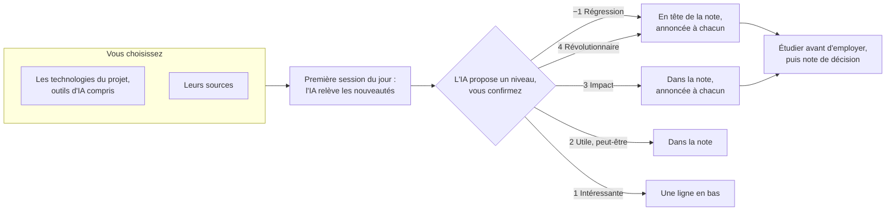

↑ [[index|L'essentiel]] · ← [[fiche-6|6. Le socle, par criticité]] · [[fiche-8|8. Améliorer, niveau par niveau]] →

L'humain oublie le pull avant de travailler ; l'IA relit la règle à chaque session, en tête d'AGENTS.md ([[fiche-6#AGENTS.md, l'exemple|fiche 6]]). Mais une consigne écrite reste un conseil ; un hook s'exécute quoi que décide le modèle [\[17\]](source-17). D'où trois étages : la règle pour tous, le hook quand l'outil le permet, les interdits bloqués dans ses réglages.

**Au premier message**, l'IA montre ce qui n'est pas commité (vos notes écrites dans Obsidian) et le fait commiter avec votre accord ; alors seulement, elle fait le pull, vous dit ce qui a changé, lit le sommaire et pose ses questions. **Avant chaque modification**, nouveau pull : un coéquipier a pu pousser. **Après**, commit des seuls fichiers touchés, avec un message qui dit le fait (« Ajoute la décision sur le fournisseur », pas « maj »), puis push ; si votre équipe a adopté le questionnaire, il passe avant le commit ([[fiche-4#Le questionnaire|fiche 4]]). DORA associe des commits fréquents à de meilleurs gains avec l'IA [\[3\]](source-03).

> [!question] Pourquoi commiter avant le pull, et pas l'inverse ?
> Dans le cas normal, l'IA fait bien le pull d'abord : avant chaque modification, sur un dossier propre, rien ne peut entrer en conflit. Le commit passe avant le pull dans deux cas seulement : il reste des notes écrites à la main, ou le push a été refusé parce qu'un coéquipier a poussé entre-temps. Le travail existe déjà ; il faut le mettre à l'abri avant de récupérer celui des autres.
> - **Un commit reste sur votre poste.** Le conflit se règle chez vous, jamais sur GitHub ([[fiche-8#Plus tard, un serveur qui veille|fiche 8]]).
> - **Un commit est un point de retour.** Si la fusion tourne mal, `git merge --abort` vous ramène exactement à ce commit.
> - **Des modifications non commitées sont fragiles.** Si le pull touche les mêmes fichiers, git refuse de le faire ; s'il le fait et que la fusion rate, il ne sait pas toujours les reconstruire [\[20\]](source-20).

## Ce qui a changé

Le socle sait tout ce que l'équipe y a écrit ; vous, seulement ce que vous avez lu. D'où ce point, au premier message : ce qui a changé depuis votre dernière session, regroupé par auteur et par sujet. L'IA s'y retrouve grâce à une étiquette git, `vu`, qui ne quitte pas votre poste : elle marque ce que vous avez déjà vu, et l'IA la déplace après chaque point. À tout moment, demandez aussi un rapport de ce que le socle dit d'un sujet, ou de ce qui a bougé en dernier. Lisez-le comme si un coéquipier vous parlait, et posez vos questions ; le questionnaire peut s'y appliquer aussi ([[fiche-4#Le questionnaire|fiche 4]]). Tant que vous continuez de nourrir le socle vous-mêmes et de lire ce qu'y versent les autres, vous gardez la main dessus. Un serveur peut faire ce rapport chaque matin ([[fiche-8#Plus tard, un serveur qui veille|fiche 8]]).

**Pour revenir en arrière**, décrivez le résultat voulu, pas la commande : « remets cette note comme avant ma dernière modification ». L'IA choisit la commande ; celles qui détruisent sont bloquées ou soumises à votre accord (réglages ci-dessous). Demandez-lui ce qu'elle va lancer, et pourquoi, avant de dire oui.

**En cas de conflit**, git s'arrête et inscrit les deux versions dans le fichier, entre des marqueurs `<<<<<<<` et `>>>>>>>` [\[20\]](source-20) ; l'IA suit le skill resoudre-conflit ([[fiche-6#Un skill, l'exemple, resoudre-conflit|fiche 6]]). Un conflit signalé par Obsidian ne se résout ni à la main ni sur téléphone : ouvrez votre IA. Ce montage simple, tout le monde sur `main`, a ses limites ; des pistes pour aller plus loin, que je n'ai pas testées : [[fiche-8#Aller plus loin avec git, des pistes à explorer|fiche 8]].

**Le blocage des interdits** arrête l'erreur courante, pas un contournement : selon la documentation de Claude Code, sa liste n'est « pas une barrière de sécurité » [\[17\]](source-17).

**Responsabilité.** Le commit porte le nom du membre : son IA, sa responsabilité. Plusieurs outils (Claude Code, Cursor, Aider…) ajoutent une ligne `Co-authored-by` qui nomme l'IA [\[18\]](source-18) : gardez-la.

## La veille

Le point « Ce qui a changé » suit ce que l'équipe a écrit ; la veille suit ce que le monde a changé dans les technologies de votre projet. Vos bibliothèques changent, vos outils d'IA plus vite encore : des réglages de ces fiches seront dépassés, et c'est pour ça que leurs faits sur les outils sont datés. Une veille technologique, c'est suivre ces changements, régulièrement et avec méthode, pour ne pas vous faire dépasser [\[22\]](source-22). Mettez-la en place dès le début.

**Un seul cercle : votre projet.** Ses technologies, vos outils d'IA compris, et rien d'autre. Ce qui vous intéresse à titre personnel relève d'une veille à vous, de votre côté.

**Vous choisissez** les technologies à suivre et leurs sources, dans une note du socle. Quelques exemples, à vous de juger lesquels valent la peine : les notes de version de chaque bibliothèque (sur GitHub, le flux `/releases.atom` du dépôt), les alertes de sécurité de GitHub (Dependabot), les blogs des éditeurs de vos outils d'IA, des sites d'articles techniques comme HackerNoon.

**Le rituel.** Une note de veille par jour où il y a du neuf, `veille/AAAA-MM-JJ.md` : la première session du jour l'écrit, quel que soit le membre, après le pull ; si la note existe déjà, un coéquipier l'a faite. Demandez-la aussi quand vous voulez. Elle arrive chez les autres par le pull, et le point « Ce qui a changé » la présente. Pas de mail ni de message tant qu'il n'y a pas de serveur ([[fiche-8#Plus tard, un serveur qui veille|fiche 8]]).

**Chaque nouveauté reçoit un niveau** : l'IA le propose, vous le confirmez.

| Niveau | La nouveauté… | Où elle arrive |
|---|---|---|
| −1. Régression | rend obsolète ou casse une fonction de votre projet | en tête de la note, annoncée au premier message de chacun, avec une note de décision ([[fiche-4#Réfléchir avec l'IA\|fiche 4]]) |
| 1. Intéressante | ne sert pas le projet | une ligne en bas de la note |
| 2. Utile, peut-être | pourrait servir au projet | dans la note |
| 3. Impact significatif | change ce que le projet peut faire, ou comment | dans la note, annoncée au premier message |
| 4. Révolutionnaire | transformerait le projet si vous l'adoptiez | comme −1 |



**Étudiez avant d'employer.** Apprendre un nouvel outil, c'est exactement la situation de l'étude de la [[fiche-3#Le plus grand danger, vous|fiche 3]] : avec l'IA, on apprend moins, sauf si on s'en sert pour comprendre [\[8\]](source-08). Un niveau −1, 3 ou 4 ouvre donc une étude, pas un chantier. C'est ce que je fais pour chaque nouvelle technologie de mon propre serveur, par exemple Tailscale (un réseau privé entre mes appareils), avant de m'en servir. Ce qu'un membre apprend entre dans le socle ([[fiche-4#Nourrir le cerveau|fiche 4]]). Gardez toujours un coup d'avance, surtout sur la machine.

> [!tip]- Pour aller plus loin : d'autres rituels, et ce que j'ai construit chez moi
> **D'autres rituels que l'IA peut tenir.**
> - **Avant une réunion avec votre encadrant**, elle prépare ce que vous lui envoyez, à partir des notes, des décisions ouvertes et de ce qui a changé depuis la dernière réunion.
> - **Après la réunion**, elle verse le compte rendu dans le socle : décisions prises, tâches nouvelles.
> - **Avant une échéance**, elle relit ce que le cahier des charges promet et le compare à ce qui est fait.
>
> **Ce que j'ai construit chez moi**, avec Pilotage (la page qui tient mes tâches, mes décisions et mes projets) et Suivi ECE (celle où je suis les équipes que j'encadre) :
> - **Un tableau des tâches partagé.** Une carte par tâche, avec son responsable, sa colonne (à faire, en cours, à vérifier, terminé) et ce qu'elle attend : une autre carte, une décision, une date. Le tableau calcule les cartes prêtes, celles que plus rien ne retient : c'est la réponse à « qu'est-ce que je fais ensuite ? ». Pilotage a commencé comme artefact claude.ai, une page que l'IA écrit et qui se partage ; au début, un fichier du dépôt suffit.
> - **La fiche du jour.** En fin de travail, chaque session note ce qu'elle a fait avancer, ce qui reste et la prochaine action. Chacun sait où en sont les autres, sans réunion.
> - **Les décisions à trancher**, dans un onglet : chaque question avec ses options, la recommandation de l'IA et son importance, en rouge si elle bloque un travail en cours. On tranche depuis la page, et aucune session ne repose une question déjà tranchée.
> - **Un suivi en couleurs.** Suivi ECE donne à chaque équipe une couleur, justifiée en une phrase, avec sa dernière et sa prochaine réunion et son avancement par rapport à ses objectifs. Chez vous, ce serait la même chose par membre ou par objectif du cahier des charges.
>
> Chacune de ces pages est un projet en soi : commencez par le tableau, et seulement quand le socle tient. Plus loin encore, un serveur peut faire la veille seul et vous l'envoyer ([[fiche-8#Plus tard, un serveur qui veille|fiche 8]]).

## Réglages par outil

> [!note]- Au 30/09/26 : lisez-les, puis faites-les poser par votre IA
> - **Claude Code**, `.claude/settings.json`, versionné [\[17\]](source-17) :
> ```json
> {"hooks": {"SessionStart": [{"matcher": "startup|resume",
>    "hooks": [{"type": "command", "command": "git pull --ff-only"}]}]},
>  "permissions": {
>    "allow": ["Bash(git status*)", "Bash(git diff*)", "Bash(git log*)",
>      "Bash(git tag -f vu)", "Bash(git pull*)", "Bash(git add *)",
>      "Bash(git commit *)", "Bash(git push)"],
>    "ask": ["Bash(git stash*)", "Bash(git clean*)", "Bash(git restore*)",
>      "Bash(git checkout -- *)", "Bash(rm *)"],
>    "deny": ["Bash(git push *--force*)", "Bash(git push -f*)", "Bash(git push * -f*)",
>      "Bash(git reset --hard*)", "Bash(git commit *--no-verify*)",
>      "Bash(git commit -n*)", "Bash(git commit * -n*)"]}}
> ```
> Comment c'est construit. `hooks` : le pull lancé à chaque ouverture ; avec `--ff-only`, s'il fallait fusionner, le pull échoue sans rien toucher, et l'IA suit le rituel. `allow` : le quotidien, sans demander. `ask` : l'outil demande votre accord. `deny` : jamais. Ces listes reprennent les interdits d'AGENTS.md : la règle écrite, puis son blocage. `-n` est la forme courte de `--no-verify`. Sous Windows, Claude Code peut lancer ses commandes en PowerShell : si un membre est sous Windows, le responsable fait doubler par son IA chaque règle `Bash(...)` d'une règle `PowerShell(...)` [\[17\]](source-17), et chacun refait le test du push à blanc.
> - **Autres outils** : le responsable valide, d'après leur documentation [\[18\]](source-18), la lecture d'AGENTS.md, le hook et les permissions. Deux pièges : Codex ne charge le hook du projet que si le dossier est déclaré de confiance, sinon pas de pull automatique, sans message ; Aider ne fait ni pull ni push seul, et demande votre accord à chaque commande (exception au « sans rappel » du niveau 1, [[fiche-8|fiche 8]]).

## Sources de cette fiche

Toutes les sources, par famille : [[index#Toutes les sources|L'essentiel]].

- [\[3\]](source-03) **L'IA amplifie ce qui existe déjà.** Près de 5 000 professionnels du logiciel interrogés. [DORA, Google Cloud, 23/09/25](https://services.google.com/fh/files/misc/2025_state_of_ai_assisted_software_development.pdf)
- [\[8\]](source-08) **Apprendre avec l'IA sans chercher à comprendre, c'est moins apprendre.** 52 développeurs qui découvraient une bibliothèque Python ; pas encore relue par des pairs. [Shen et Tamkin, Anthropic, 29/01/26](https://www.anthropic.com/research/AI-assistance-coding-skills), et [l'article](https://arxiv.org/abs/2601.20245)
- [\[17\]](source-17) **Règles, mémoire, hooks et interdits dans Claude Code.** [Mémoire et AGENTS.md](https://code.claude.com/docs/en/memory), [bonnes pratiques](https://code.claude.com/docs/en/best-practices), [hooks](https://code.claude.com/docs/en/hooks-guide), [permissions](https://code.claude.com/docs/en/permissions), [mode plan](https://code.claude.com/docs/en/permission-modes#analyze-before-you-edit-with-plan-mode), [PowerShell](https://code.claude.com/docs/en/permissions), [les coûts d'une longue session](https://code.claude.com/docs/en/costs), [la fenêtre de contexte et le résumé](https://code.claude.com/docs/en/context-window)
- [\[18\]](source-18) **Les outils d'IA et leurs prix.** Documentation : [skills de Claude Code](https://code.claude.com/docs/en/skills), [Codex](https://learn.chatgpt.com/docs), [Gemini CLI](https://geminicli.com/docs), [Antigravity](https://antigravity.google/docs), [VS Code](https://code.visualstudio.com/docs), [Copilot](https://docs.github.com/en/copilot), [Cursor](https://cursor.com/docs), [Aider](https://aider.chat/docs). Modes plan : [Cursor](https://cursor.com/docs/agent/plan-mode), [Codex](https://learn.chatgpt.com/guides/best-practices), [Gemini CLI](https://geminicli.com/docs/cli/plan-mode/), [Antigravity](https://antigravity.google/docs/cli/modes/), [Copilot dans VS Code](https://code.visualstudio.com/docs/agents/run/planning), [Aider](https://aider.chat/docs/usage/modes.html). [Projets partagés de ChatGPT](https://help.openai.com/en/articles/10169521). Offres : [Obsidian](https://obsidian.md/blog/free-for-work/), [GitHub](https://docs.github.com/en/get-started/learning-about-github/githubs-products), [Claude](https://claude.com/pricing), [pack étudiant GitHub](https://education.github.com/pack)
- [\[20\]](source-20) **Git, GitHub et le contrôle de secrets.** [Conflits et fusion](https://git-scm.com/docs/git-merge), [push refusé](https://docs.github.com/en/get-started/using-git/dealing-with-non-fast-forward-errors), [fins de ligne](https://git-scm.com/docs/gitattributes), [pre-commit](https://pre-commit.com), [gitleaks](https://github.com/gitleaks/gitleaks), [ne pas synchroniser un dépôt par un cloud](https://git-scm.com/docs/gitfaq), [chercher dans les fichiers](https://git-scm.com/docs/git-grep), [les liens dans un fichier Markdown sur GitHub](https://docs.github.com/en/get-started/writing-on-github/getting-started-with-writing-and-formatting-on-github/basic-writing-and-formatting-syntax), [les liens d'un wiki GitHub](https://docs.github.com/en/communities/documenting-your-project-with-wikis/editing-wiki-content), [les worktrees](https://git-scm.com/docs/git-worktree), [les pull requests](https://docs.github.com/en/pull-requests/collaborating-with-pull-requests/proposing-changes-to-your-work-with-pull-requests/about-pull-requests), [verrouiller un fichier avec Git LFS](https://github.com/git-lfs/git-lfs/wiki/File-Locking), [pandoc, du Markdown au PDF](https://pandoc.org/MANUAL.html)
- [\[22\]](source-22) **Organiser sa veille technologique.** Ce qu'est une veille, ses étapes, et comment l'automatiser par des alertes et des flux RSS. [Bibliothèques de l'Université Rennes 2, « Organiser sa veille informationnelle », 04/05/26](https://tutos.bu.univ-rennes2.fr/c.php?g=688574)

↑ [[index|L'essentiel]] · ← [[fiche-6|6. Le socle, par criticité]] · [[fiche-8|8. Améliorer, niveau par niveau]] →

Olivier & Mentordinator
